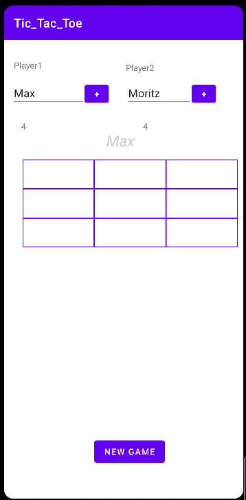
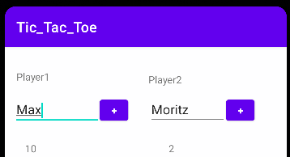
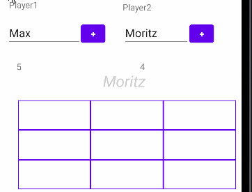

# MVC-TicTacToe
Technologie und Planung

## Prerequisites
* [Android Studio](https://developer.android.com/studio)

## Structure

Model: 

* Logic of TicTacToe Game
* Database
* Player-Entity-Data-Class
* Player-Data-Access-Object-Interface

View:

* Interface

Controller:

* MainActivity 

## How to use

Predifined Users

With new players

## Features

### Change Names

**Remember**: Um den Spieler erfolgreich zu wechseln, muss man auf dem **+** Button klicken.

### Switch Player when winning

